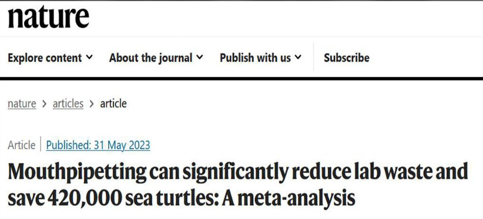

<!-- README.md is generated from README.Rmd. Please edit that file -->

# my-GEO712-repository

# **0. Summary of File Structure**

This readme document is stored in an R project structure titled
“Activity2.” In this project structure, there are a number of folders
and files. The `renv` folder stores the respective R packages and their
versions for this project. The `images` folder contains any relevant
images for the project and any inserted images will be stored and pulled
from this folder. The folder `plots` stores any generated data plots.
The folder `data.raw` contains any relevant raw data, before any
processing is done on them.

# **1. Main Area of Research**

There is currently a drug crisis with **devastating** socioeconomic
impacts. My research interest involves optimizing and applying a
capillary electrophoresis mass-spectromety (CE-MS) based approach for
large-scale screening of illicit, over-the-counter, and prescription
drugs in high-risk populations (low income, homeless,etc). Currently,
data pre-processing is **extremely time intensive**, hampering CE-MS’s
ability for real-world application in the field. My goal is to optimize
an existing data-processing script and create a user friendly user
interface in addition to optimizing the script to accurately identify
drugs and their metabolites. This script will then be applied to a large
cohort and extensively tested before being applied in the field.
Additionally I will be working with psychiatrists to assess what they
desire in such a platform.

# **2. Favourites**

## *2.1 Favourite Music*

1.  Even in the Quietest Moments - Supertramp
2.  Feels So Good - Chuck Mangione
3.  City of Stars - Justin Hurwiz
4.  Goddess - Laufey
5.  Le festin - Michael Giacchino

## *2.2 Favourite equation*

$$
x = \frac{-b\pm \sqrt{b^2-4ac}}{2a}  
$$

## *2.3 Favourite Artists*

| Name           | Achievements                                                                                                                                     |
|----------------|--------------------------------------------------------------------------------------------------------------------------------------------------|
| Justin Hurwiz  | Composer of the musical score for La La land                                                                                                     |
| Hanz Zimmmer   | One of the best movie composers, e.g. composition of “Time”                                                                                      |
| Chuck Mangione | Got \#4 on the Billboard Hot 100 chart in 1978 as a jazz musician playing a flugelhorn (never happened before, probably will never happen again) |
| Bob Ross       | Master of painting and sharing the joy of painting                                                                                               |
| Euthymides     | Ancient athenian potter and painter of vases famous for painting the vases such as “Achilles and Ajax”                                           |

# **3. A Chunk of Code**

    r AirPassengers, echo = FALSE
    plot(AirPassengers)

<!-- --> \# **4.
Hyperlink**

I am experimenting with package
[{here}](https://cran.r-project.org/src/contrib/Archive/ggplot2/)

``` r
library(here)
#> here() starts at C:/Users/ereth/Desktop/McMaster/GEOG702/my-GEO712-repository
```

# **5. Image**

This is an image of a false (but amusing) paper

``` r
knitr::include_graphics(paste0(here(), "/images/mouthpipetting_false_document.png"))
```

<!-- -->

# **6. Plotting**

<!-- badges: start -->
<!-- badges: end -->
